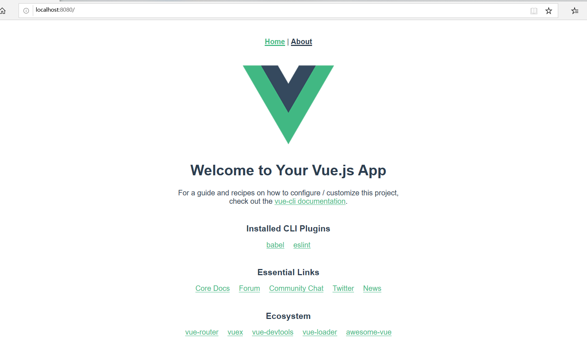
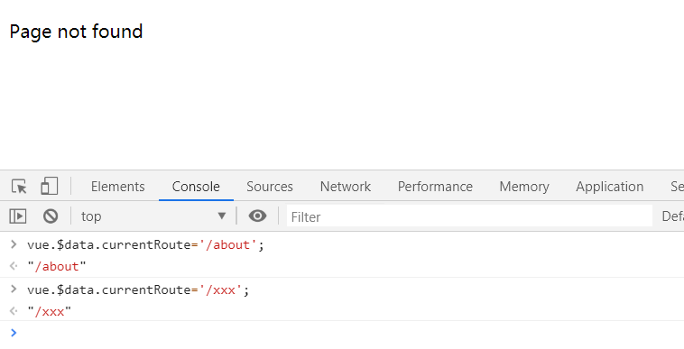

## 建议
阅读下文之前建议简单看一下上一篇文件：[webpack+vue介绍](http://www.tandi.wiki/webpack_vue%E4%BB%8B%E7%BB%8D/)

推荐书籍：《Vue.js实战》

## 什么是MVVM模式
1. MVVM，即`ModelView-View-Model`，由MVC(Model-View-Controller)衍生而来
2. 其中View与ModelView为双向绑定，Model与ModelView亦为双向绑定，如下图：


简单理解一下什么是ModelView-View-Model

    Model：业务逻辑和数据模型
    View：视图层
    ModelView：数据中转站

拓展：MVC中M，即Model，一些人认为Model只是数据实体本身（Entity/Pojo）；其实并不如此，Service层+Dao层+数据实体等均为Model

## vue对象的生命周期
### 介绍
1. 所谓的生命周期，就是对象从出生到死亡的过程
2. 在vue中对象有着特定的生命周期钩子，钩子指的是函数(方法)，这些函数会在生命周期的某个特定时间被自动触发

哪到底有哪些生命周期钩子呢？以下为官网的一张图片:

beforeCreate：在vue对象被创建之前触发

create：对象创建完成之后触发

beforeMount：在将对象挂载到标签之前触发

mounted：对象挂载完成后触发

beforeUpdate：对象状态被更改之前触发

updated：对象状态被更新之后触发

beforeDestroy：对象被销毁(死亡)之前触发

destroyed：对象被销毁（死亡）后触发

### 基本使用


## 表达式表达式
基本使用

表达式过滤器

计算


## vue指令
### v-if/v-else/v-else-if
    分支语句，接受值为boolean

### v-bind
    单向绑定，监听值得变化;v-bind可以省略而直接使用：代替

### v-model
    双向绑定，即监听值得变化，也可以影响值
    v-model的修饰符：
    v-model.lazy,表达式改为失焦或按确定后才同步值
    v-model.number,将输入的值转为Number类型，不指定则默认为String
    v-model.trim,去除输入值得收尾空格

### v-on
    绑定事件，如：v-on:click="函数名称"，绑定点击事件，可以简写为@click="函数名称"

### v-text/v-html
    直接输出值，并不监听值得变化，v-html会识别值中的html标签进行渲染

### v-for
    循环，如：v-for="person in persons"，将产生多个标签值

### v-show
    类似于css中的display，接受值为boolean

### v-pre
    类似于html中的pre标签，在v-pre下，vue表达之将失效，无需接收值，直接在标签中添加v-pre即可

### v-cloak
    用于防止网速慢，而使得vue表达式直接显示出来，无需接收参数

### v-once
    可以让表达式只渲染一次，即使是双向绑定，也不会再生效，无需接收参数

### :class
    标签class属性，可以用于判断是否启用class或变更class；如:class="class1:isActive",当isActive为true则使用class1

### :style
    区别于:class，:style为内联样式；如：:style="{'color':color}"

## vue对象中的方法
### 使用


### 部分修饰符使用
.stop：@click.stop="clickBtn",可以阻止事件冒泡

.prevent：form标签中@submit.prevent="函数名称"或@submit.prevent，可以禁止提交表单后刷新页面

.once：@click.once，只触发1次

*键盘修饰符*

.enter：@click.enter="函数名称"

还有.ctrl/.tab/.delete/.space/.up/.down/.left/.right/.alt/.shift/./esc等等，需要注意的是在vue中修饰符是可以串联的，即可以同时使用


## vue组件
### 说明
1. 在上一片文章中已经提到，vue是可以将页面抽象为可复用的组件的，而每一个组件都含有自己的css/html/javascript
2. vue中的组件，从另一个层面来说就是减少冗余的代码，让其能复用，从而避免ctrl+c/ctrl+v
3. 组件（Component）是vue中的核心功能

### 组件使用


### 父组件向子组件传递数据(props字段使用)
简单使用

使用vue对象数据

模板的数据验证


### 子组件向父组件传递数据
#### 说明
1. 父组件想子组件传递可以通过props属性完成
2. 子组件想父组件传递数据，则使用事件派发，即通过自定义的事件处理函数来完成数据的向上传递

#### 例子1
``` html
<!DOCTYPE html>
<html lang="en">
<head>
    <meta charset="UTF-8">
    <!-- 使用script标签加载稳定版vue的cdn文件 -->
    <script src="https://unpkg.com/vue/dist/vue.min.js"></script>
</head>
<body>
    <div id="app">
        <h3>总数：{{total}}</h3>
        <!-- @相当于注册一个监听 -->
        <global-component @add="getTotalHandler" @subtract="getTotalHandler"></global-component>
    </div>
</body>

<script type="text/javascript">

    // 使用Vue对象注册一个全局组件
    Vue.component('global-component', {
        template: "<div><button @click='addHandler'>加1</button> <button @click='subtractHandler'>减1</button></div>",
        // 注意：在组件中，data必须是一个函数，并且改函数返回的是一个jsonui想；而不像vue对象中写直接携程data：{}
        // 原因是组件是可能会被多处使用，这样做的原因是为了确保每一处返回的json都是独立的 
        data () {
            return { count: 0 }
        },
        methods: {
            addHandler () {
                this.count++;
                // 相当于将this.count传递给父组件的add属性(事件)
                this.$emit('add', this.count);
            }, 
            subtractHandler () {
                this.count--;
                // 相当于将this.count传递给父组件的subtract属性(事件)
                this.$emit('subtract', this.count);
            }
        },
    });

    const app = new Vue({
        el: '#app',
        data: {
            total: 0
        },
        methods: {
            // 接受一个外面传进来的value
            getTotalHandler (value) {
                this.total = value;
            }
        }
    });
</script>
</html>
```
#### 例子2-emit和input事件使用
``` html
<!DOCTYPE html>
<html lang="en">
<head>
    <meta charset="UTF-8">
    <!-- 使用script标签加载稳定版vue的cdn文件 -->
    <script src="https://unpkg.com/vue/dist/vue.min.js"></script>
</head>
<body>
    <div id="app">
        <h3>总数：{{total}}</h3>
        <!-- 使用双向绑定 -->
        <!-- v-model默认 -->
        <global-component v-model="total"></global-component>
        <!-- 正常方法 -->
        <!-- <global-component @input="getTotalHandler"></global-component> -->
    </div>
</body>

<script type="text/javascript">

    Vue.component('global-component', {
        template: "<div><button @click='addHandler'>加1</button></div>",
        data () {
            return { count: 0 }
        },
        methods: {
            addHandler () {
                this.count++;
                // 相当于使用input事件将this.count赋值给total
                this.$emit('input', this.count);
            }
        },
    });

    const app = new Vue({
        el: '#app',
        data: {
            total: 0
        },
        methods: {
            getTotalHandler (value) {
                this.total = value;
            }
        }
    });

</script>
</html>
```

### 非父子关系的组件通信
``` html
<!DOCTYPE html>
<html lang="en">
<head>
    <meta charset="UTF-8">
    <!-- 使用script标签加载稳定版vue的cdn文件 -->
    <script src="https://unpkg.com/vue/dist/vue.min.js"></script>
</head>
<body>
    <div id="app">
        <global-component></global-component>
    </div>
</body>

<script type="text/javascript">

    // 使用一个空的vue对象来做事件广播
    const bus = new Vue();

    Vue.component('global-component', {
        template: "<div><button @click='addHandler'>加1</button></div>",
        data () {
            return { count: 0 }
        },
        methods: {
            addHandler () {
                this.count++;
                // 提交this.count到on-message监听
                bus.$emit('on-message', this.count);
            }
        },
    });

    const app = new Vue({
        el: '#app',
        mounted() {
            // 监听on-message
            bus.$on('on-message', function(value){
               window.alert(value)
            })
        }
    });

</script>
</html>
```


### 父子组件相互直接访问
``` html
<!DOCTYPE html>
<html lang="en">
<head>
    <meta charset="UTF-8">
    <!-- 使用script标签加载稳定版vue的cdn文件 -->
    <script src="https://unpkg.com/vue/dist/vue.min.js"></script>
</head>
<body>
    <div id="app">
        total = {{total}}
        count = {{count}}
        <global-component ref="one"></global-component>
        <button @click='getChildrenCount'>count加1</button>
    </div>
</body>

<script type="text/javascript">

    Vue.component('global-component', {
        template: "<div><button @click='addHandler'>total加1</button></div>",
        data () {
            // 返回一份独立的数据
            return { count: 0 }
        },
        methods: {
            addHandler () {
               // 直接访问父节组件的数据
               this.$parent.total++;

               this.count++;
            }
        },
    });

    const app = new Vue({
        el: '#app',
        data: {
            total: 0,
            count: 1
        },
        methods: {
            getChildrenCount(){
                // 获取子组件的属性，因为父组件可能包含多个子组件，所以this.$children为数组
                this.count = this.$children[0].count;
            }
        },
        mounted() {
            // 除了上的形式还可使this.$refs配合ref="标记"访问
            console.info(this.$refs.one);
        },
    });

</script>
</html>
```

### 普通插槽


### 作用域插槽


### 对vue组件加深理解


### 还可以这样定义组件
``` html
<!DOCTYPE html>
<html lang="en">
<head>
    <meta charset="UTF-8">
    <script src="https://unpkg.com/vue/dist/vue.min.js"></script>
</head>
<body>
    <div id="app">
        <mt></mt>
    </div>
</body>

<!-- 还可以这样定义模板html -->
<script type="text/x-template" id="template-id">
    <div>
        <input type="text" placeholder="..." />
    </div>
</script>

<script type="text/javascript">

    Vue.component('mt', {
        template: '#template-id'
    });

    const app = new Vue({
        el: '#app'
    });

</script>
</html>
```

### render（渲染）函数的基本使用
> 详细参考官方教程：https://cn.vuejs.org/v2/guide/render-function.html

#### 使用例子1
``` html
<!DOCTYPE html>
<html lang="en">
<head>
    <meta charset="UTF-8">
    <script src="https://unpkg.com/vue/dist/vue.min.js"></script>
</head>
<body>
    <div id="app">
        <!-- 向level属性绑定一个值 -->
        <anchored-heading :level="level">Hello world!</anchored-heading>
    </div>
</body>

<script type="text/x-template" id="anchored-heading-template">
    <h1 v-if="level === 1">
      <slot></slot>
    </h1>
    <h2 v-else-if="level === 2">
      <slot></slot>
    </h2>
    <h3 v-else-if="level === 3">
      <slot></slot>
    </h3>
</script>

<script type="text/javascript">
   
   Vue.component('anchored-heading', {
        //template: '#anchored-heading-template',

        // 使用render（渲染）函数来代替template来创建模板，因为template定义了重复的标签，所以在这种情况，不是很简洁
        render (createElement) {
            // 这个对象是vue2.x的概念，虚拟节点，即这里返回的并不是一个实质的dom
            // 所谓的虚拟节点其实是差异部分，说白了就和原来dom不同的部分
            return createElement(
                'h' + this.level,   // 标签名称
                this.$slots.default // 子节点数组（节点内容）
        )},
        props: {
            level: {
                type: Number,
                required: true
            }
        }
    })

    const app = new Vue({
        el: '#app',
        data: {
            level: 2
        },
    });

</script>
</html>
```

#### createElement参数
``` javascript
createElement(
    'div', // 标签名字，String类型或是一个虚拟节点（vnode，即使用createmElement()创建的对象）
    {}, // 模板定义，json对象（自选）
    [] // 子节点，数组类型（自选）
);

// 模板定义json（参考官网）
{
    // 与 `v-bind:class` 的 API 相同，
    // 接受一个字符串、对象或字符串和对象组成的数组
    'class': {
        foo: true,
        bar: false
    },
    // 与 `v-bind:style` 的 API 相同，
    // 接受一个字符串、对象，或对象组成的数组
    style: {
        color: 'red',
        fontSize: '14px'
    },
    // 普通的 HTML 特性
    attrs: {
        id: 'foo'
    },
    // 组件 prop
    props: {
        myProp: 'bar'
    },
    // DOM 属性
    domProps: {
        innerHTML: 'baz'
    },
    // 事件监听器在 `on` 属性内，
    // 但不再支持如 `v-on:keyup.enter` 这样的修饰器。
    // 需要在处理函数中手动检查 keyCode。
    on: {
        click: this.clickHandler
    },
    // 仅用于组件，用于监听原生事件，而不是组件内部使用
    // `vm.$emit` 触发的事件。
    nativeOn: {
        click: this.nativeClickHandler
    },
    // 自定义指令。注意，你无法对 `binding` 中的 `oldValue`
    // 赋值，因为 Vue 已经自动为你进行了同步。
    directives: [
        {
        name: 'my-custom-directive',
        value: '2',
        expression: '1 + 1',
        arg: 'foo',
        modifiers: {
            bar: true
        }
        }
    ],
    // 作用域插槽的格式为
    // { name: props => VNode | Array<VNode> }
    scopedSlots: {
        default: props => createElement('span', props.text)
    },
    // 如果组件是其它组件的子组件，需为插槽指定名称
    slot: 'name-of-slot',
    // 其它特殊顶层属性
    key: 'myKey',
    ref: 'myRef',
    // 如果你在渲染函数中给多个元素都应用了相同的 ref 名，
    // 那么 `$refs.myRef` 会变成一个数组。
    refInFor: true
}

```

#### 使用例子2
``` html
<!DOCTYPE html>
<html lang="en">
<head>
    <meta charset="UTF-8">
    <script src="https://unpkg.com/vue/dist/vue.min.js"></script>
</head>
<body>
    <div id="app">
        <m v-model="v"></m>
        <mh1></mh1>
        <mh2></mh2>
    </div>
</body>

<script type="text/javascript">
   
   // 基本使用
   Vue.component('m', {
        render (createElement) {
            return createElement('input', {
                // 注册模板属性
                props: {
                    value: Number
                },
                // 模板标签的html规范属性
                attrs: {
                    id: 'ids',
                    type: 'text',
                    placeholder: '......'
                },
                // 添加原生事件
                on: {
                    click: this.clickHandler
                }
            }, null);
        },
        methods: {
            // 处理点击事件的函数
            clickHandler () {
                alert('hello !!!');
            }
        },
    })

    // 创建父子标签1
    Vue.component('mh1', {
        render (createElement) {
            return createElement('h1', {
                attrs: {
                    id: 'h1id'
                }
                // 添加子标签 和 slot
            }, [ createElement('h4', '444'), this.$slots.default=2 ]);
        }
    })

   // 创建父子标签2
   Vue.component('mh2', {
        render (createElement) {
            // 创建五个相同的标签
            return createElement('h2', Array.apply(null, {
                length: 5
            }).map(() => {
                return createElement('h6', '666');
            }));
        }
    })

    const app = new Vue({
        el: '#app',
        data: {
            v: 2
        }
    });

</script>
</html>
```

### 函数化组件使用
``` html
<!DOCTYPE html>
<html lang="en">
<head>
    <meta charset="UTF-8">
    <script src="https://unpkg.com/vue/dist/vue.min.js"></script>
</head>
<body>
    <div id="app">
        <m :data="data"></m>
    </div>
</body>

<script type="text/javascript">

    // 组件1
    var btn1 = {
        props: {
            data: Number
        },
        render (createElement) {
            return createElement('button', '按钮1');
        }
    }

    // 组件2
    var btn2 = {
        props: {
            data: Number
        },
        render (createElement) {
            return createElement('button', '按钮2');
        }
    }

    // 函数化组件：实质可以理解为一个组件选择器，根据传入的参数来选择需要的组件
    Vue.component('m', {  
        props: {
            data: Number
        },
        // 表示当前组件为函数化组件
        functional: true,
        render (createElement, context) {

            function getComponent () {
                var data = context.props.data;
                if (data === 1) return btn1;
                if (data === 2) return btn2;
            }

            // 返回组件
            return createElement( getComponent() );
        }
    })

    const app = new Vue({
        el: '#app',
        data: {
            data: 2
        }
    });

</script>
</html>
```

## 自定义指令
``` html
<!DOCTYPE html>
<html lang="en">
<head>
    <meta charset="UTF-8">
    <script src="https://unpkg.com/vue/dist/vue.min.js"></script>
</head>
<body>
    <div id="app">
        <input type="text" placeholder="输入内容..." v-focus/>
       <input type="text" placeholder="输入内容..." v-focus/>
    </div>
</body>

<script type="text/javascript">

    /* directive中的钩子函数
        bind: 只会被调用一次，在指令绑定到元素上时调用
        inserted: 指令元素插入到父节点（标签）时调用
        update: 指令元素所在的模板更新时调用
        componentUpdate: 指令元素所在的模板完成更新后调用
        unbind: 指令与元素解绑时调用
    */
    let num = 1;

    // 全局自定义指令
    Vue.directive('focus', {
        bind (el, binding, vnode) {
            // el名字是固定的，代表当前的dom对象
            el.value = num++;

            // binding,代表当前的指令
            console.info("binding = ", binding);
            // vue编译生成的虚拟节点，实质就是vue根据当前指令所在的标签生成的vue对象
            // 注意：虚拟节点是vue2.x对vue1.x的提升
            console.info("vnode = ", vnode);
        }
    });

    const app = new Vue({
        el: '#app',
        // 局部自定义指令
        //directives: {
        //}
    });

</script>
</html>
```


## vue-cli使用

### 说明

* vue-cli是一个基于webpack和webpack-dev-server之上构建的工具
* vue-cli提供快速创建vue项目模板
* 所谓的vue脚手架，脚手架这个词个人非常讨厌，不知道想表达什么


### 安装

```
npm install -g @vue/cli
```


### 使用vue-cli构建一个项目模板

> 文档：<https://cli.vuejs.org/zh/guide/>

```
vue create hello-world
```

生成的模板项目如下：


### 运行项目访问一下

```
npm run serve
```

http://localhost:8080/ 

如下：

> 对于刚学习vue来说，这个模板也很有参考价值




### 组件开发的基本概念

* 可以看到使用`vue create`命令生成的项目模板下有以`.vue`结尾的文件
* 其中vue文件就代表项目中的一个组件；组件，简单点可以理解为通用的零件，但这个零件特别之处在于它是可以复用的，即需要的时候都可以使用它


vue组件格式如下：

> 注意：vue组件的模板是没有名字的，通过import xxx from ‘*.vue’ 赋予变量后使用

``` vue
<!-- 组件模板 -->
<template>
</template>

<!-- vue对象 -->
<script>
export default {
}
</script>

<!-- 组件自用的style -->
<style scope>
</style>
```


## vue-router

### 说明

vue-router，是vue中的一个插件，从名字可以看出其充当路由的职责；

路由，说白点就是一个”指路人“，即网站需要跳转到那里，怎么跳转，这都时router的职责；


### 先用数组来实现一个简单的router

index.html

``` html
<!DOCTYPE html>
<html lang="en">
<head>
    <meta charset="UTF-8">
    <script src="https://unpkg.com/vue/dist/vue.min.js"></script>
</head>
<body>
    <div id="app">
    </div>
</body>
</html>
<script type="text/javascript" src="./main.js"></script>
```

main.js

``` javascript
const NotFound = { template: '<p>Page not found</p>' }
const Home = { template: '<p>home page</p>' }
const About = { template: '<p>about page</p>' }

// 路由列表
const routes = {
  '/': Home,
  '/about': About,
  '*': NotFound
}

// 小技巧：使用一个常量指向vue实例，就可以在chrome的console中动态修改vue实例的状态
const vue = new Vue({
  el: '#app',
  data: {
    // 默认
    currentRoute: '/'
  },
  computed: {
    ViewComponent () {
      return routes[this.currentRoute] || NotFound
    }
  },
  render (h) { 
    return h(this.ViewComponent) 
  }
})
```

测试




### 数组router实现简单的标签页

``` html
<!DOCTYPE html>
<html lang="en">
<head>
    <meta charset="UTF-8">
    <script src="https://unpkg.com/vue/dist/vue.min.js"></script>
</head>
<body>
    <br><br><br>
    <center>
        <div id="app">
            <menux></menux>
            <contentx></contentx>
        </div>
    </center>
</body>
</html>

<script type="text/javascript">

    const NotFound = { template: '<p>Page not found</p>' }
    const About = { template: '<p>about page</p>' }
    const Home = { template: '<p>Home page</p>' }
    
    // 路由列表
    const routes = {
        '/': Home,
        '/about': About,
    };

    Vue.component('contentx', {
        computed: {
            ViewComponent () {
                return routes[this.$parent.$data.currentPath] || NotFound;
            }
        },
        render (h) { 
            return h(this.ViewComponent) 
        }
    })

    Vue.component('menux', {
        template: `
            <div>
                <a href='#' @click='dispatch("/")'>Home</a>|<a href='#' @click='dispatch("/about")'>About</a>|
                <a href='#' @click='dispatch("/other")'>Other</a>
            </div>
        `,
        methods: {
            dispatch (path) {
                this.$parent.$data.currentPath = path;
            }
        }
    });

    const vue = new Vue({
        el: '#app',
        data: {
            currentPath: '/'
        }
    });

</script>
```


### 项目中使用router

参考vue-cli项目模板


## 关于npm命令

* 项目成库中克隆下载，使用npm根据package.json文件自动安装需要的模块

  > 默认根据package.json文件信息安装需要的模块

  ```
  npm install 
  ```

  