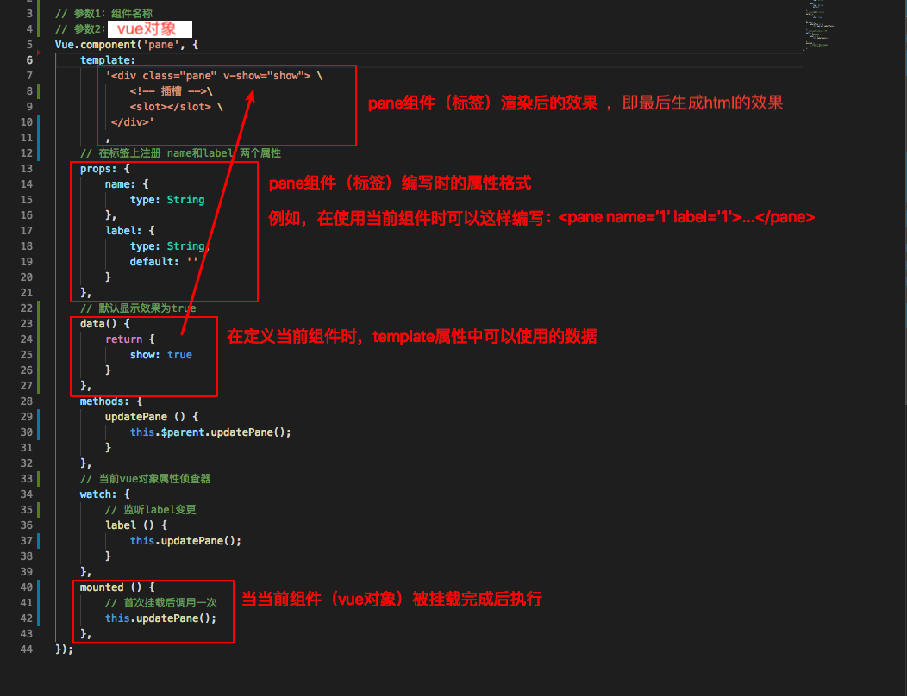

该例子源自《Vue.js实战》

代码阅读顺序：
    index.html -> tbas.js -> pane.js

对vue组件的定义理解：



<!-- index.html渲染后的效果 -->
``` html
<div id="app">

    <div class="tabs">

        <div class="tabs-bar">
            <div class="tabs-tab tabs-tab-active">标签页1</div>
            <div class="tabs-tab">标签页2</div>
            <div class="tabs-tab">标签页3</div>
        </div>
        
        <div class="tabs-content">
            <div class="pane" style="">
                标签页1内容
            </div> 
            <div class="pane" style="display: none;">
                标签页2内容
            </div> 
            <div class="pane" style="display: none;">
                标签页3内容
            </div>
        </div>
    </div>
</div>
```
